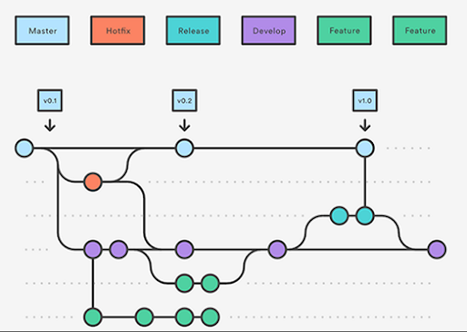

# Git Best Practices

## Basic commands

- Cloning a remote repository to your local computer
    > $ cd /Your/Directory  
    > $ git clone https<nolink>://your-repository.git

- Displaying the state of the working directory  
(such as: current branch, number of commits ahead, modified files, staged files, ...)
    > $ git status

- Updating your local repository with the remote repository
    > $ git pull

- Adding modified files to the stage area
    > $ git add file-1 file-2 file-3  

    Alternatively, you can add all the files at once
    > $ git add .

- Commiting the staged files to your local branch
    > $ git commit -m 'A meaningful commit message'

- Updating the remote repository with your local repository
    > $ git push

## How to use branches

A branch represents an independent line of development.  
You can think of them as a way to request a brand new working directory and project history.  
New commits are recorded in the history of the current branch.  
When the work is done, the new commits can be integrated into the original branch.

- Listing your current local branches
    > $ git branch

- Creating new local branch
    > $ git branch your-new-branch-name

- Creating new remote branch
    > $ git push -u origin your-new-branch-name

- Switching local branches
    > $ git checkout your-new-branch-name

- Deleting local branch
    > $ git branch --delete your-branch-name

- Deleting remote branch
    > $ git push --delete origin your-branch-name

## Pull requests

Pull requests are a way to initiate discussions around a branch.  
They give other developers the opportunity to contribute to the new feature before it gets integrated into the official project.

1) In your repository GUI, go to "Pull requests"
2) Select "New pull request"
3) Select the base and target branches
4) Click "Create pull request"
5) Configure the pull request:
    - reviewers: ask people to review your code
    - assignees: assign people to accept your request and merge the branches
    - labels
    - projects
    - milestone
5) Create pull request
6) Once there's nothing more to be done, the feature can be merged by the assigners.

## Protected branches

Protected branches is a powerful tool to enforce certain workflows in the repository.   
If you're the repository owner or have admin permissions, you can customize brach protections through your Git GUI in order to:
- prevent branches from being deleted
- prevent direct commits (force push) to the branch
- require pull request reviews before merging
- require status check before merging

## Git Workflow

Git Workflow is a strict branching model designed around the project release.  
It assigns very specific roles to different branches and defines how and when they should interact.

It is ideally suited for larger projects that have scheduled release cycle.

- Master and Develop Branches  
Instead of a single _master_ branch, this workflow uses two branches to record the history of the project. The _master_ branch stores the official realese history, and the _develop_ branch server as an integration branch for features.

- Feature Branches  
Each new feature should reside in its own branch, which can be pushed to the central repository for backup and collaboration. But, instead of branching off of _master_, feature branches use _develop_ as their parent branch. When a new feature is complete, it gets merged back into _develop_.  
Important: features should never interact directly with _master_.

- Release Branches  
Once _develop_ has acquired enough features for a release, you fork a _release_ branch off of _develop_.  
Creating this branch starts the next release cycle, so no new feature can be added after this points - only bug fixes, documentation and other release-oriented tasks should go into this branch.  
Once it's ready to ship, the _release_ branch gets merged into _master_ and into _develop_, since it may have progressed since the release was initiated.  
Using a dedicated branch to prepare releases makes it possible for one team to polish the current release while another team continues working on features for the next release.  

- Hotfix Branches  
Maintenance or _hotfix_ branches are used to quickly patch production releases. As soon as the fix is complete, it should be marged into both _master_ and _develop_.  
This allows the team to address issues without interrupting the rest of the workflow or waiting for the next release cycle.  
importante: this is the only branch that should fork directly from _master_.

## How to write issues

Issues are a way to collect users feedback, report software bugs, and organize tasks you'd like to acomplish. But while their simple structure makes it easy for others to weigh in, issues are really only as good as you make them.

Here are some tips on writing issues:

- avoid duplication: search for similar issues before creating a new one
- one issue per issue: each issue must contain only one task / problem
- short titles: further explanation can be done in the issue comment
- formatting: issue comment is done using markdown so it can be well-formatted
- reproduction: if possible, provide instructions to reproduce the bugs
- information: attach links and screenshots whenever possible
- references: use "@" in a comment to notify someone to join the discussion
- labels: link issues to specific labels
- milestones: link issues to specific miletones
- assignees: people who could work on the issue

A great way to remind people on how to create good issues is to configure issue templates.  
Some examples can be found in this repository under templates/issue_templates/.

## References

- [Basic Git commands](https://confluence.atlassian.com/bitbucketserver/basic-git-commands-776639767.html)
- [Git branch](https://www.atlassian.com/git/tutorials/using-branches)
- [Pull requests](https://www.atlassian.com/git/tutorials/comparing-workflows/feature-branch-workflow)
- [Git Workflow](https://www.atlassian.com/git/tutorials/comparing-workflows/gitflow-workflow)
